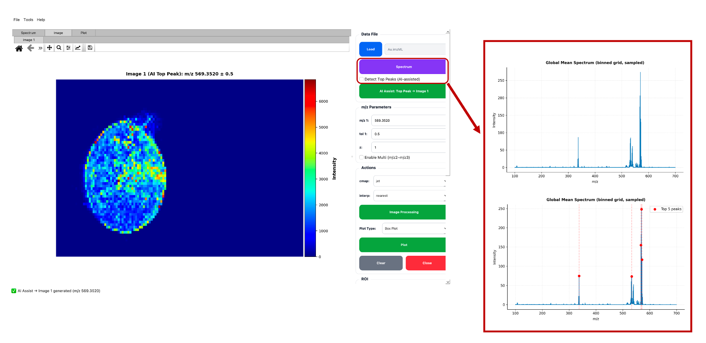
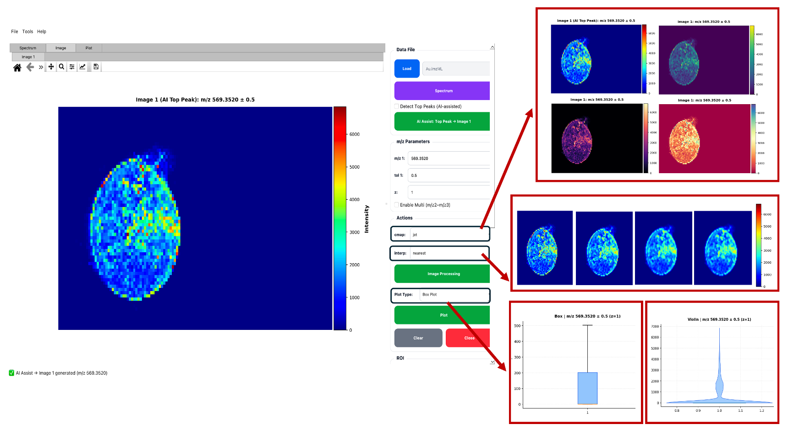
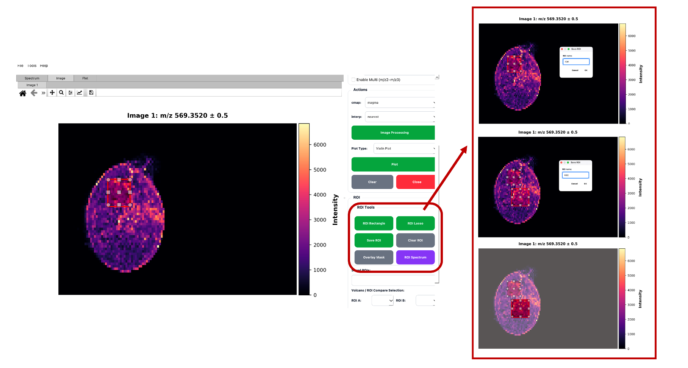
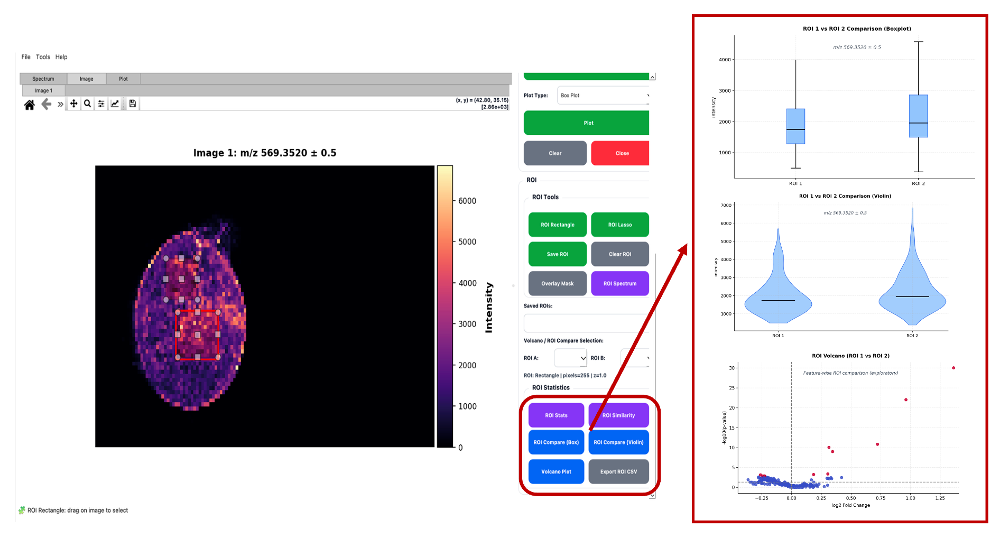

<p align="center">
  
</p>

<h2 align="center">PyMSIViz</h2>

<p align="center">
A user-controlled, open-source graphical interface for Mass Spectrometry Imaging (MSI) data exploration
</p>
<p align="center">
  
  
  
  
  
</p>

## Overview
**PyMSIViz** is an open-source, Python-based graphical user interface designed for interactive visualization and exploratory analysis of mass spectrometry imaging (MSI) data.  
The software enables inspection of spectra, ion image generation, region-of-interest (ROI) analysis, and ROI-based statistical comparison without requiring scripting knowledge.

## Running the GUI
PyMSIViz provides a standalone desktop graphical application for MSI data exploration.
```bash
python main.py
```
## Installation
### Requirements
- Python ≥ 3.9
- NumPy
- SciPy
- Matplotlib
- PyQt5
- pyimzML
### Install dependencies
```bash
pip install -r requirements.txt
```
### AI-Assisted Spectrum Exploration

PyMSIViz enables rapid exploration of global MSI spectra using AI-assisted peak detection.
As shown above, dominant m/z features are automatically identified from the global mean spectrum
(binned and sampled for efficiency) and can be directly used to generate ion images.

This interactive workflow allows users to:
- Inspect the global spectral profile of the dataset
- Identify dominant peaks without manual peak picking
- Instantly visualize corresponding ion images
- Use detected peaks as starting points for ROI-based analysis
- 
<p align="center">
  
</p>

**Figure 1.** Global spectrum visualization and AI-assisted detection of the top five m/z peaks in PyMSIViz,
providing a rapid entry point from spectral overview to spatial analysis.


<p align="center">
  
</p>

**Figure 2.** Ion image rendering with adjustable colormap and interpolation settings, combined with
ROI-based boxplot and violin plot summaries for exploratory MSI analysis in PyMSIViz.


<p align="center">
  
</p>

**Figure 3.** Interactive ROI selection using rectangle and lasso tools, with ROI masking and visualization
directly on ion images in PyMSIViz.


<p align="center">
  
</p>

**Figure 4.** ROI-based statistical comparison using boxplots, violin plots, and exploratory volcano plots
for MSI signal assessment in PyMSIViz.

